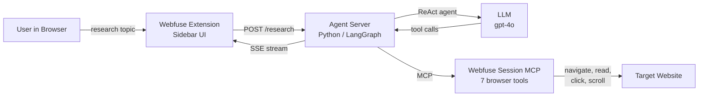

# LangChain/LangGraph + Webfuse MCP

A multi-step research agent that compares data across web pages. Built with [LangGraph](https://langchain-ai.github.io/langgraph/) and [Webfuse Session MCP](https://dev.webfu.se/session-mcp-server/).

**Live demo:** [webfu.se/+langchain-mcp/](https://webfu.se/+langchain-mcp/)

## What It Does

Enter a research topic. The agent plans its approach, navigates to multiple web pages, extracts data with targeted CSS selectors, and delivers a structured comparison. You watch every step happen live in your browser.

**Example:** "Compare Amsterdam and Rotterdam: population, area, and top attractions" - the agent visits Wikipedia for each city, reads the infoboxes, and presents a side-by-side comparison.

## Architecture



The extension sends a research topic to the agent. The agent uses LangGraph's `create_react_agent` with async tool wrappers that call Webfuse MCP via Streamable HTTP.

## Prerequisites

- Python 3.10+
- An [OpenAI](https://platform.openai.com) API key (or swap to Anthropic/Google)
- A [Webfuse](https://webfuse.com) account with a Space
- The Automation App installed on your Space

## Quick Start

```bash
cd agent
pip install -r requirements.txt
cp ../.env.example .env        # Add your keys
uvicorn agent:app --port 8082
```

Deploy the `extension/` folder as a Webfuse extension on your Space. Set the `AGENT_URL` env var to your server URL.

## Configuration

| Variable | Description | Where to get it |
|----------|-------------|----------------|
| `OPENAI_API_KEY` | LLM API key (default) | [platform.openai.com](https://platform.openai.com) |
| `WEBFUSE_REST_KEY` | Space REST API key (`rk_...`) | Webfuse dashboard > Space > API Keys |
| `AGENT_URL` | Agent server URL (extension env) | Your server URL or Cloudflare tunnel |

**Swap the LLM in one line:**

```python
from langchain_anthropic import ChatAnthropic
llm = ChatAnthropic(model="claude-sonnet-4-20250514")
```

## How It Works

The agent has 7 of the 13 available MCP tools, chosen for research workflows:

| Tool | What it does |
|------|-------------|
| `navigate` | Go to a URL |
| `see_dom_snapshot` | Read page HTML (with CSS selector scoping) |
| `see_accessibility_tree` | Read page structure |
| `act_click` | Click an element |
| `act_scroll` | Scroll the page |
| `act_type` | Type into form fields |
| `act_key_press` | Press keyboard keys |

**What makes this different:** Multi-page reasoning. The agent plans which pages to visit, navigates between them, uses targeted CSS selectors (`.infobox`, `table.wikitable`) to avoid context overflow, and presents structured comparisons.

**Files:**

```
extension/             Webfuse extension (sidebar UI)
agent/                 Python agent server (FastAPI + LangGraph)
```

## Links

- [Webfuse](https://webfuse.com)
- [Session MCP Server docs](https://dev.webfu.se/session-mcp-server/)
- [LangGraph docs](https://langchain-ai.github.io/langgraph/)

## Other Webfuse Integrations

- [OpenAI Agents SDK](https://github.com/webfuse-com/extension-openai-agents-mcp) - Python agent with browser control
- [Vercel AI SDK](https://github.com/webfuse-com/extension-vercel-ai-mcp) - Next.js browsing assistant
- [LiveKit Voice Agent](https://github.com/webfuse-com/extension-livekit-mcp) - Voice-controlled browser
- [ChatGPT GPT](https://github.com/webfuse-com/chatgpt-webfuse-mcp) - Custom GPT with browser tools

## License

MIT
